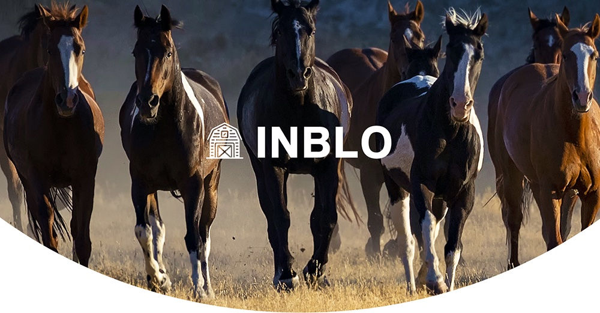

<!-- PROJECT LOGO -->
 

  <!--  -->

<h3 align="center">Inblo</h3>

  

    Flutter project for managing horses and trainers
     
 
    <a href="https://github.com/treefunk/inblo_flutter/issues">Report Bug</a>
    ·
    <a href="https://github.com/treefunk/inblo_flutter/issues">Request Feature</a>
  

